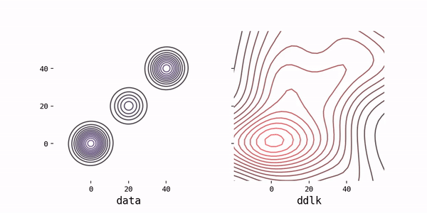

# DDLK: Deep direct likelihood knockoffs

This package implements DDLK, a method for variable selection with explicit control of the false discovery rate.
Install with:
```
pip install ddlk
```



## Controlled variable selection with DDLK

Suppose you have a set of features and a response.
DDLK identifies the features most predictive of the response at a pre-specified false discovery rate (FDR) threshold.
For example, if you choose an FDR of 20%, DDLK can guarantee that no more than 20% of the selected features will be unimportant.
To learn more about how it works, check out [our paper](https://arxiv.org/abs/2007.15835).

## Running DDLK

Variable selection with DDLK involves three stages:

1. Fit a joint distribution to model features
2. Fit a knockoff generator
3. Sample knockoffs and apply [knockoff filter](https://arxiv.org/abs/1610.02351) to select variables at a pre-specified FDR

To see a complete working example, check our [synthetic data example](examples/ddlk_synthetic_example_CPU.ipynb), used to generate the gif above.
Below is an exceprt of how to run DDLK.

### Fitting a joint distribution

This implementation of DDLK uses the fast and easy [PyTorch Lightning framework](https://github.com/PytorchLightning/pytorch-lightning) to fit `q_joint`:

```python
# initialize data
x, y = ...
# put your data in standard PyTorch format
trainloader = ...
# initialize joint distribution model with mean and std of data
((X_mu, ), (X_sigma, )) = utils.get_two_moments(trainloader)
hparams = argparse.Namespace(X_mu=X_mu, X_sigma=X_sigma)
q_joint = mdn.MDNJoint(hparams)
```


```python
# create and fit a PyTorch Lightning trainer
trainer = pl.Trainer()
trainer.fit(q_joint, train_dataloader=trainloader)
```

### Fitting a knockoff generator

```python
# initialize and fit a DDLK knockoff generator
q_knockoff = ddlk.DDLK(hparams, q_joint=q_joint)
trainer = pl.Trainer()
trainer.fit(q_knockoff, train_dataloader=trainloader)
```

### Variable selection

Using the knockoff generator, we sample knockoffs, and run a [Holdout Randomization Test](https://arxiv.org/abs/1811.00645):

```python
xTr_tilde = q_knockoff.sample(xTr)
knockoff_test = hrt.HRT_Knockoffs()
knockoff_test.fit(xTr, yTr, xTr_tilde)
```


# Citing this code
If you use this code, please cite the following paper ([available here](https://arxiv.org/abs/2007.15835)):
```
Deep Direct Likelihood Knockoffs
M. Sudarshan, W. Tansey, R. Ranganath
arXiv preprint arXiv:2007.15835
```
Bibtex entry:
```
@misc{sudarshan2020deep,
    title={Deep Direct Likelihood Knockoffs},
    author={Mukund Sudarshan and Wesley Tansey and Rajesh Ranganath},
    year={2020},
    eprint={2007.15835},
    archivePrefix={arXiv},
    primaryClass={stat.ML}
}
```
